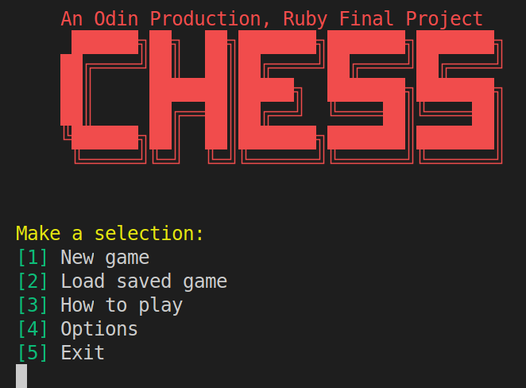
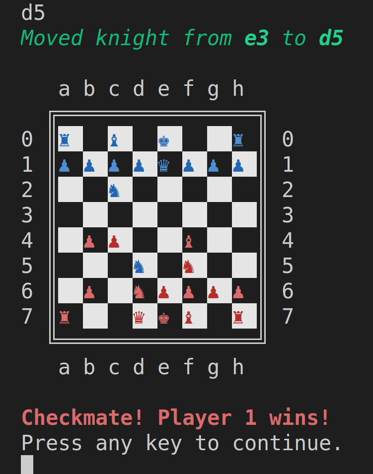
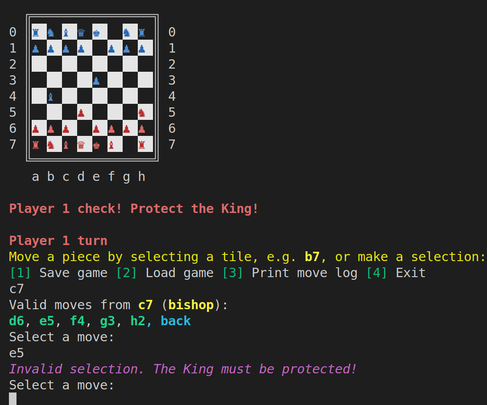
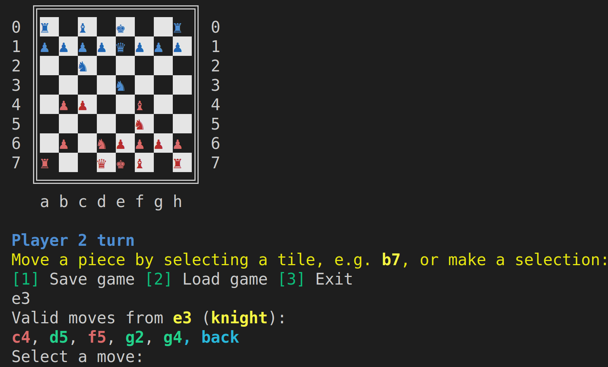
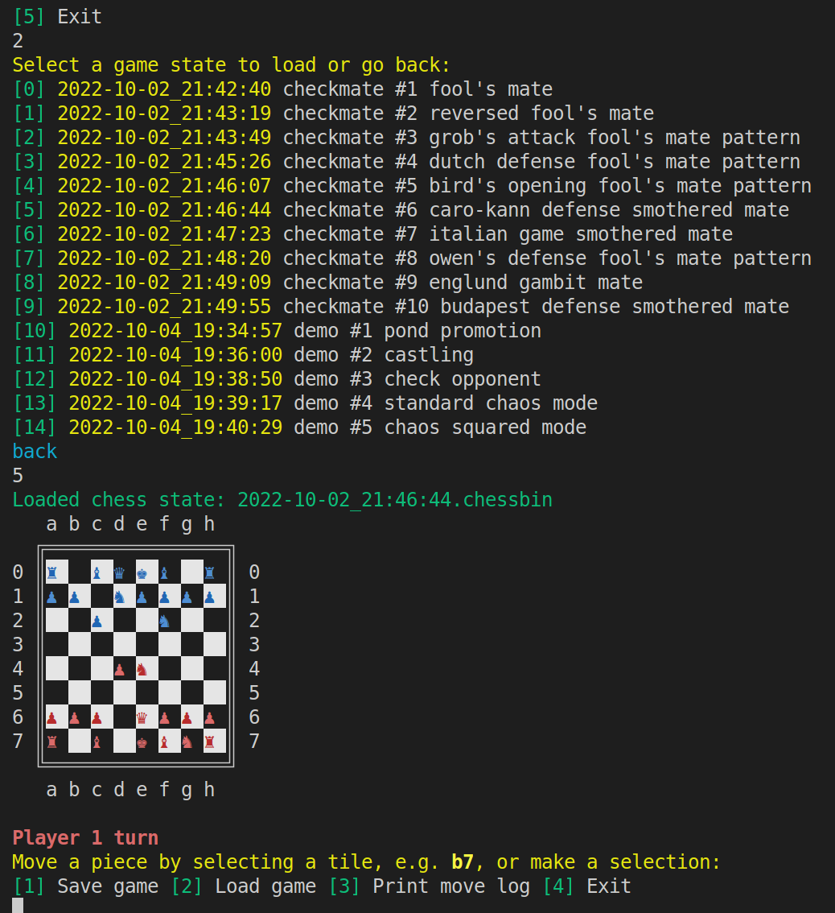
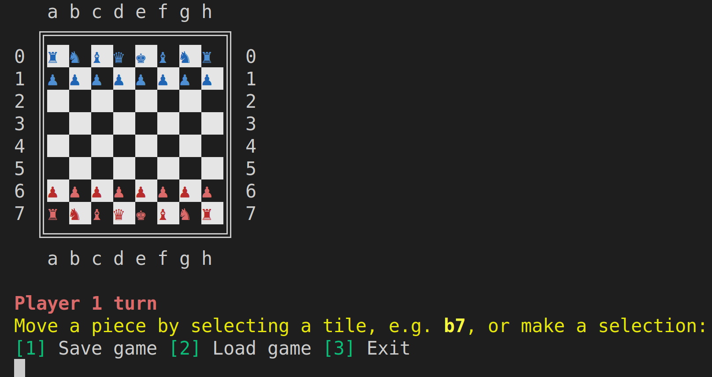
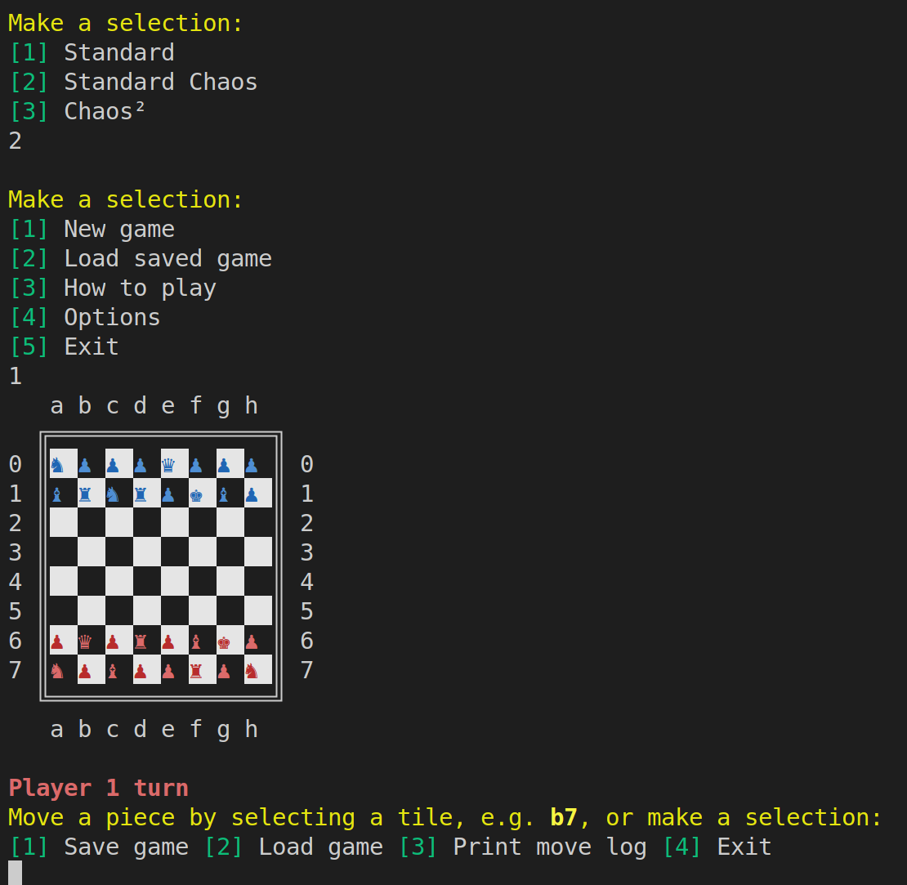
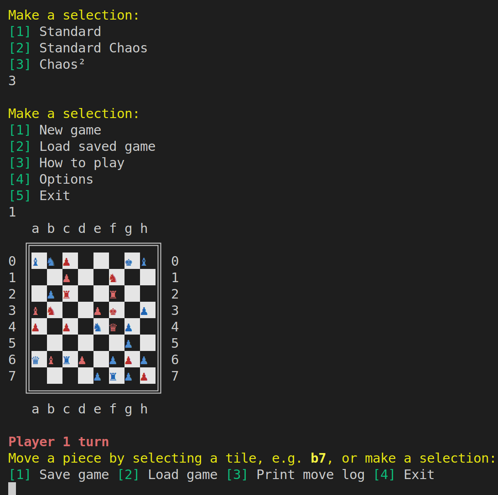
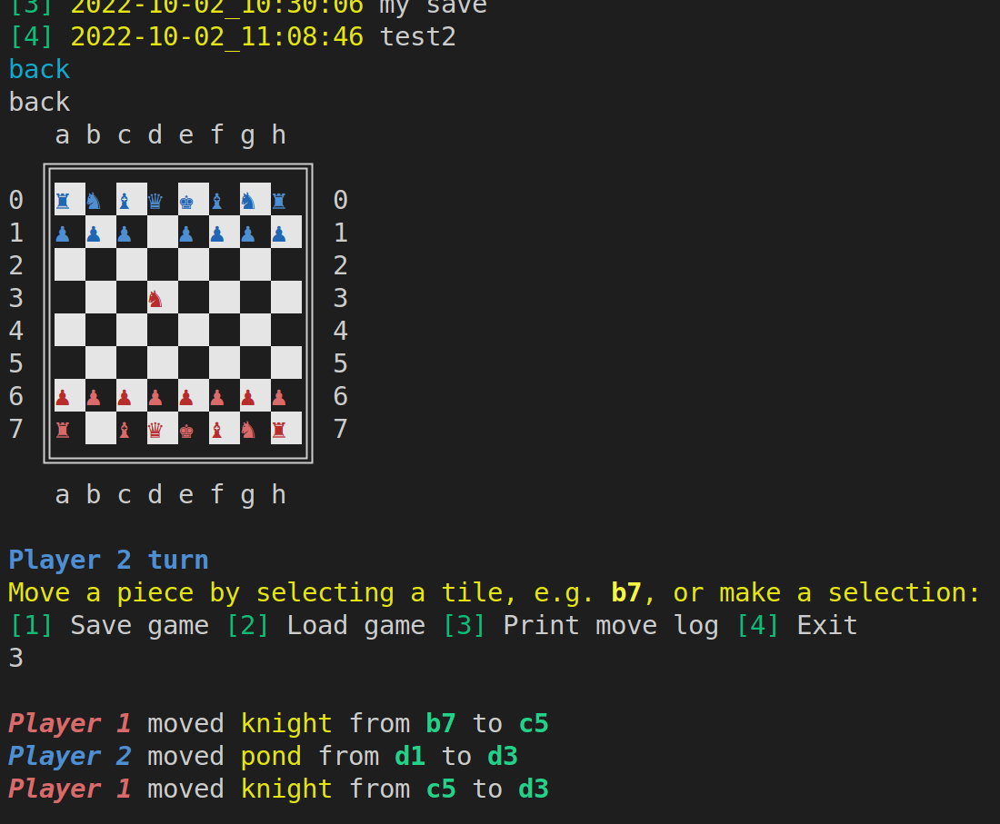

# Odin: Ruby Chess
Command line chess game implemented with `ruby` for the TOP `ruby` final project. [👉Live Demo.👈]("")

### Limitations
Implements basic game mechanics (movement and checkmate, etc.), but is still missing a few features:
* En passant
* Pond promotion
* Castling
* Stalemate checking

### Requirements
- [x] Properly constrained, prevent players from making illegal moves, and declare check or check mate in correct situations
- [x] Save board at any time
- [x] Write tests for important parts (TDD not required)
- [x] Keep classes modular and clean, methods each only do one thing; single responsibility principle
- [ ] (Optional) Build a very simple AI computer player
- [x] (Optional my idea) Chaos/fun mode that scrambles the pieces into ramble positions or enable pieces to do crazy/illegal moves

### Resources
* [chess wiki](https://en.wikipedia.org/wiki/Chess)
* [illustrated rules of chess](http://www.chessvariants.org/d.chess/chess.html)
* [chess notation](https://en.wikipedia.org/wiki/Chess_notation)
* [chess unicode characters](https://en.wikipedia.org/wiki/Chess_symbols_in_Unicode)
* [for colorizing text and shading tiles](https://stackoverflow.com/questions/1489183/how-can-i-use-ruby-to-colorize-the-text-output-to-a-terminal)
* [some checkmate patterns for testing](https://www.chess.com/article/view/fastest-chess-checkmates)

### Example Gameplay
----
#### E1. Intro Screen
Because who doesn't like ascii art?

#### E2. Checkmate
Yes, it works! You can test it yourself by loading one of the ten saved states!

#### E3. Check (Protect the King! Safe Move Enforcement)
Where's the Kinguard?!

#### E5. Syntax Highlighting
Feeling lazy? Let syntax highlighting help you. Just pick the red moves!

#### E6. Saving Games
Have other things to do like eating cereal? No problem, we can serialize your game!

#### E7. Loading Games
:D

#### E8. Board on Setup
Play standard mode chess...

#### E8. Standard Chaos Mode
Or if your feeling adventurous, mix the pieces up a bit...

#### E9. Chaos² Mode
Or if you're feeling **extra** adventurous, spice up your life with Chaos².

#### E10. Logging
Ever wonder you did/were doing a minute ago? No worries, we got you covered with logging. :)

