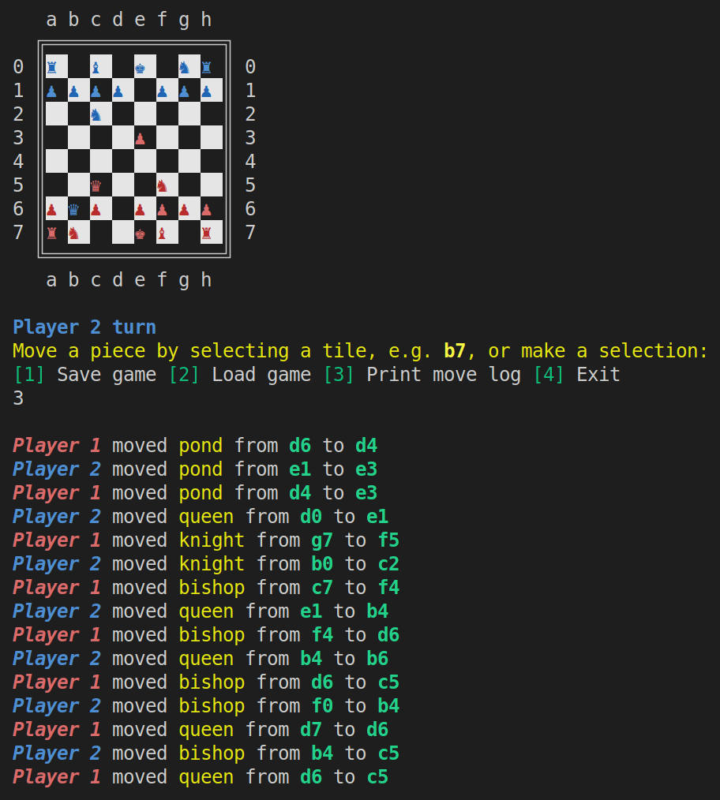

# Odin: Ruby Chess
A command line chess game implemented with `ruby` for the TOP ruby final project. Uses a composition-ish object-oriented programming approach in it's implementation.

[👉Live Demo👈](https://replit.com/@KevinKuei/Odin-Ruby-Chess#main.rb)

## Demonstration

## Requirements
- [x] Properly constrained, prevent players from making illegal moves, and declare check or check mate in correct situations
- [x] Save board at any time
- [x] Write tests for important parts
- [x] Keep classes modular and clean, methods each only do one thing; single responsibility principle
- [x] (Optional)(my idea) Chaos/fun mode that scrambles the pieces into random positions
- [ ] (Optional) Build a very simple AI computer player

## Limitations
Implements most of the basic game mechanics (i.e., movement, check, checkmate, castling, pond promotion, etc.), but is still missing a few features, namely:
* En passant
* Stalemate checking

## Resources
* [Chess Wiki](https://en.wikipedia.org/wiki/Chess)
* [Illustrated rules of chess](http://www.chessvariants.org/d.chess/chess.html)
* [Chess Notation](https://en.wikipedia.org/wiki/Chess_notation)
* [Chess Unicode Characters](https://en.wikipedia.org/wiki/Chess_symbols_in_Unicode)
* [Colorizing Text](https://stackoverflow.com/questions/1489183/how-can-i-use-ruby-to-colorize-the-text-output-to-a-terminal)
* [Checkmate Patterns for Testing](https://www.chess.com/article/view/fastest-chess-checkmates)

## Gameplay

### Splash Screen
Because who doesn't like a nice ascii splash screen?

### Checkmate
Yes, it works! :) Load up one of the checkmate demos and verify for yourself!

### Check (Safe Move Enforcement)
Where's the Kingsguard? Protect the King! 

### Castling
Castling can be called from either the rook or the king, if applicable.

#### Pond Promotion
Give that hardworking pond that long overdue promotion! ...and uh, sex change!

### Syntax Highlighting
Not sure what move to make next? Let syntax highlighting assist you--just choose violence by picking the red moves!

### Saving Games
Have other things to do? No problem, save your game...

### Loading Games
...and then pick up where you left off!

### Standard Mode
Play your standard vanilla chess game...

### Standard Chaos Mode
...or spice things up with standard chaos mode!

### Chaos² Mode
...or if you're feeling **extra** adventurous, try Chaos²!

### Logging
Ever wonder you did/were doing a minute ago? Be at ease, with move logging. 

