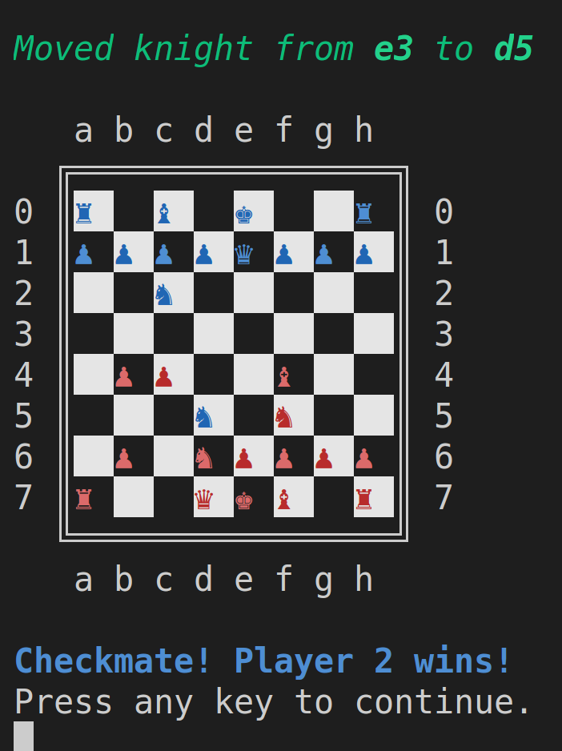
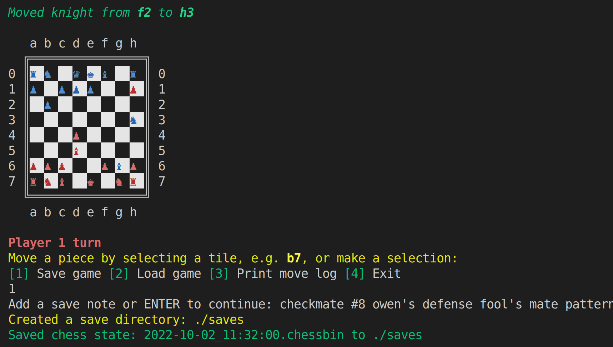

# Odin: Ruby Chess
A command line interface chess game implemented with `ruby` for the TOP ruby final project. Uses a composition-ish object-oriented programming (OOP) approach.

Implements most of the basic game mechanics (i.e., movement, check, checkmate, castling, pond promotion, etc.), in addition to a few easter egg features (e.g. chaos modes). Play against another human, a computer, or spectate by setting up two computers to play against each other in the options menu.

[👉Live Demo👈](https://replit.com/@KevinKuei/Odin-Ruby-Chess#main.rb)

## Demonstration

## Classes and Modules

The game is implemented with the following classes and modules:

### Classes

* ChessGame - Chess Game class representing the game as played.
* ChessBoard - Chess Board class representing the chess board and pieces.
* Player - Player class representing each of the players.
* Intro - Intro class for representing the intro/splash screen.
* Logger - Logger class for recording the history of player moves.
* Serializer - Serializer class for saving and restoring game states.
* String - Extends the string class for formatting text colors.
* Pond - Pond class for representing a pond chess piece.
* Knight - Knight class for representing a knight chess piece.
* Bishop - Bishop class for representing a bishop chess piece.
* Rook - Rook class for representing a rook chess piece.
* Queen - Queen class for representing a queen chess piece.
* King - King class for representing a king chess piece.
* Chancellor - Chancellor class for representing a chancellor chess piece (a chancellor combines the moves of the rook and the knight).

### Modules

* Chaos - Module containing methods related to chaos mode play.
* Promote - Module containing methods related to pond promotion.
* Castle - Module containing methods related to castling between a king and rook. Used as mixin for Rook and King classes.
* Computer - Module containing methods related to computer AI.
* ChessPiece - Module containing common functionality to all chess pieces. Used as a mixin for chess piece classes.
* Replay - Module for replaying games (not yet implemented).
* Rules - Module containing the rules of the game.
* OrthoSearch, DiagSearch - Modules containing methods for orthogonal or diaganaol next move search/identification. Used as a mixin for Rooks, Bishops, Queens, etc.

## Design

The basic design of the game revolves around the `ChessGame`, `ChessBoard`, and various implemented chess piece classes, i.e. the `Pond`, `Knight`, `Bishop`, etc. A composition-based OOP approach was adopted, wherein objects are referenced by, or passed to other objects.

A `ChessGame` requires `Players`  that interact with a `ChessBoard`. A `Serializer` to save the state of the game, and `Logger` to record move history is also included. A `ChessBoard` contains various chess piece objects (e.g., the `Pond`, `Knight`, `Bishop`, etc.). The board is represented as a nested array, where blank strings represent empty spaces, or otherwise are filled by chess piece objects. Each chess piece has instance varaibles (attributes) or knowledge of which `Player` it belongs to, it's position/location on the `ChessBoard`, its visual avatar when printed, etc. Each chess piece also has its own methods/rules defined for how it's able to move about the playing field.

A guiding principle was to implement **Classes** for objects, where roles were concretely defined, and unambiguous. **Modules** were used in contrast, to collect or group functions that had similar behaviors or functionality, but did not necessarily represent clearly defined objects on their own in an umambiguous manner.

Modules were used for mixins with classes as a form of class inheritance and to add special or desired functionality. For example, all chess piece have a `include ChessPiece` statement in their definition to include generic chess piece functionality. Some chess piece classes include modules that give it the ability to move orthogonally, or diaganolly. For example, the `Bishop` class uses a `include DiagSearch` statement, the `Rook` class a `include OrthoSearch`  statement, while the `Queen` class includes both.

The game uses a naive implementation to check whether a player is in check, or checkmate. For a given player, it simply enumerates over all pieces to see if it any of the valid moves contains the opposing King's position for a check condition. Similarly, to evaluate a checkmate condition, all of a checked player's moves are enumerated to check whether there exists a move that eliminates a checked condition. 

## Requirements
- [x] Properly constrained, prevent players from making illegal moves, and declare check or check mate in correct situations
- [x] Save board at any time
- [x] Write tests for important parts
- [x] Keep classes modular and clean, methods each only do one thing; single responsibility principle
- [x] (Optional) Build a very simple AI computer player
- [x] (Optional) Chaos/fun mode that scrambles the pieces into random positions

## Limitations
* [En passant](https://en.wikipedia.org/wiki/En_passant) move for ponds not implemented.
* Replay mode not yet implemented.

## Resources
* [Chess Wiki](https://en.wikipedia.org/wiki/Chess)
* [Illustrated rules of chess](http://www.chessvariants.org/d.chess/chess.html)
* [Chess Notation](https://en.wikipedia.org/wiki/Chess_notation)
* [Chess Unicode Characters](https://en.wikipedia.org/wiki/Chess_symbols_in_Unicode)
* [Colorizing Text](https://stackoverflow.com/questions/1489183/how-can-i-use-ruby-to-colorize-the-text-output-to-a-terminal)
* [Checkmate Patterns for Testing](https://www.chess.com/article/view/fastest-chess-checkmates)

## Gameplay

### Splash Screen
Because who doesn't like a nice ascii splash screen?

### Checkmate
Yes, it works! :) Load up one of the checkmate demos and verify for yourself!

### Check (Safe Move Enforcement)
Where's the Kingsguard? Protect the King! 

### Castling
Castling can be called from either the rook or the king, if applicable.

#### Pond Promotion
Give that hardworking pond that long overdue promotion! ...and uh, sex change!

### Syntax Highlighting
Not sure what move to make next? Let syntax highlighting assist you--just choose violence by picking the red moves!

### Saving Games
Have other things to do? No problem, save your game...

### Loading Games
...and then pick up where you left off!

### Standard Mode
Play your standard vanilla chess game...

### Standard Chaos Mode
...or spice things up with standard chaos mode!

### Chaos² Mode
...or if you're feeling **extra** adventurous, try Chaos²!

### Logging
Ever wonder you did/were doing a minute ago? Be at ease, with move logging. 

